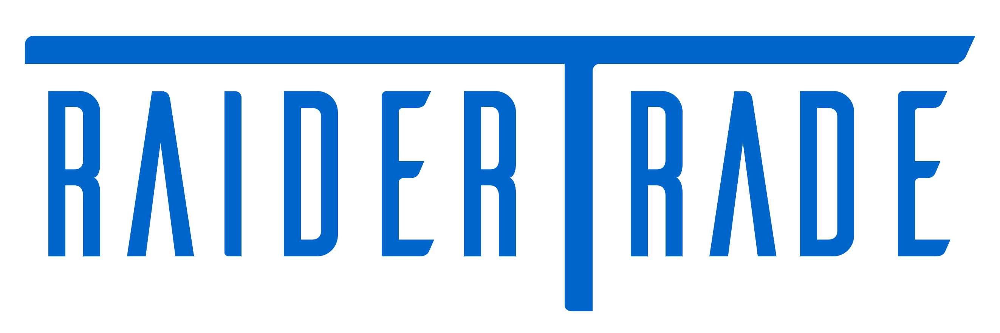

RaiderTrade is a market website for students to buy and sell textbooks and electronics.

## Motivation
RaiderTrade is made to help students save money on textbooks and electronics for their classes.
 
## Screenshots

Include logo/demo screenshot etc.

## Tech/Framework used
<b>Front End</b>
- HTML
- CSS
- JS
- Bootstrap

<b>Back End</b>
- JSP (Java Server Pages)
- MySQL

<b>Framework</b>
- Spring Boot
- Apache Maven
- JPA (Java Persistence API)
- Hibernate

<b>Architecture</b>
- RESTful API
- MVC (Model-View-Controller)
